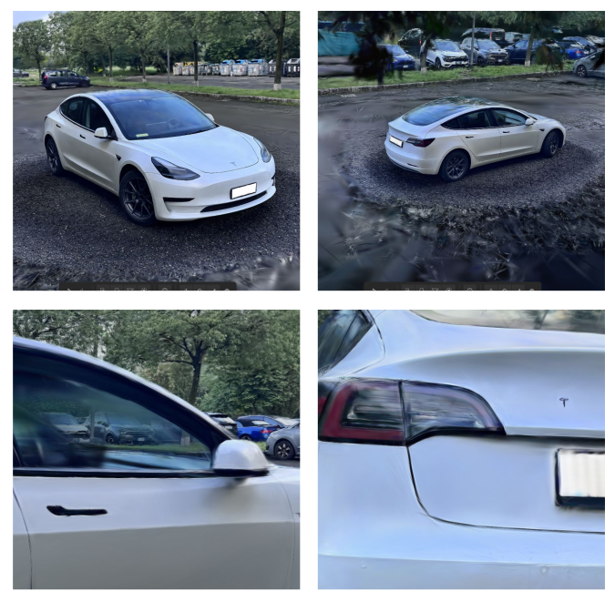
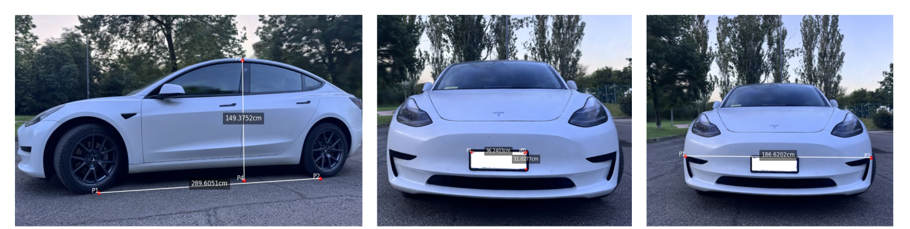
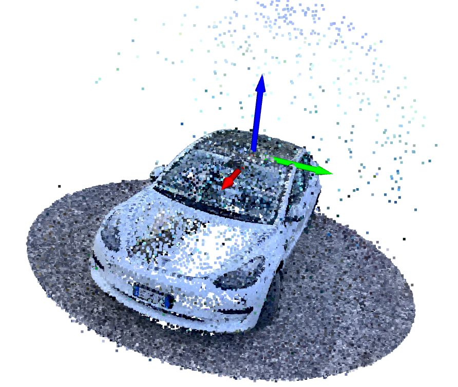
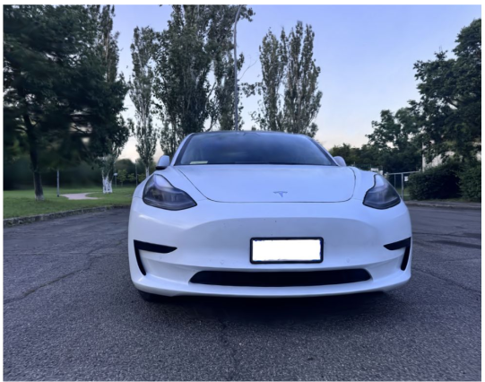
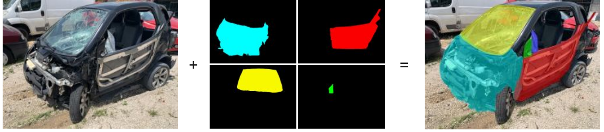
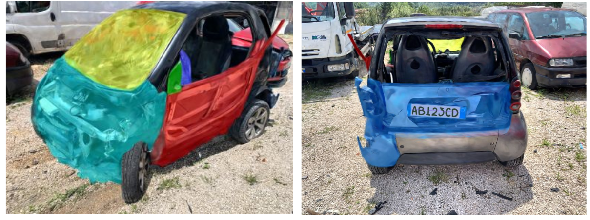
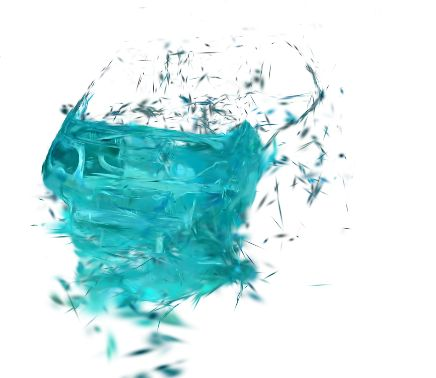

<!-- # Master Thesis -->
### Methods and Tools for 3D Rendering with Gaussian Splatting in accident reconstructions

[PDF download](https://amslaurea.unibo.it/id/eprint/33981/)

#### Abstract
In recent years, the demand for immersive and highly realistic 3D rendering has greatly increased, as its potential applications span a wide range of fields, from entertainment and virtual reality to engineering and forensic analysis. The latest advances in computer vision and image processing have played a pivotal role in enhancing both the quality and feasibility of 3D reconstructions. This thesis explores the use of 3D Gaussian Splatting as an innovative approach to achieve state-of-the-art rendering quality, specifically in the context of car accident reconstructions.

In addition to the ability to navigate around a reconstructed accident scene, other innovative tools have been developed on top of Gaussian Splatting in order to enhance the value of these visualizations and their practical usage.

First, the capacity to take precise measurements between arbitrary points within a rendered scene is a key feature that supports forensic accuracy. Achieving this level of precision requires reliable depth data, which depends on improved surface reconstruction; to this end, this thesis investigates the application of Gaussian Splatting to optimize geometry accuracy, ensuring high fidelity in depth perception and spatial relationships.

Additionally, the thesis addresses scene anonymization, focusing on the automatic removal of license plates, by replacing them with neutral patches. 
Another powerful tool discussed in this thesis is the automatic alignment of the frame of reference with the car's canonical views.

Lastly, the thesis explores techniques for the 3D segmentation of damaged car parts, allowing for a detailed assessment of impact zones and damage extent, which can be crucial for accident analysis, insurance evaluations, and legal investigations.

Together, these tools underscore the versatility and potential of advanced 3D rendering technologies in real-world applications, making 3D Gaussian Splatting a promising approach for accurate and efficient accident reconstruction.

#### Highlights

Shown below, some graphical result of the thesis.

##### Immersive Renders

##### Measurement Tool

##### Aligner Tool

##### License Plate Autocropper

##### Damage Segmentator
<!-- At disposal calibrated multi-view frames of a damaged car, a pretrained 3D gaussian model, and multi-view masks  -->
First, a dataset is composed by blending original frames with masks of a specific kind of damage.   

Then, the original 3D Gaussian Model is fine-tuned for further 3000 epochs, with disabled densification and with frozen scale, rotation and position parameters (only colors and opacities are learnable).

Lastly, by thresholding the color parameters, it is possible to retrieve the specific damaged parts

